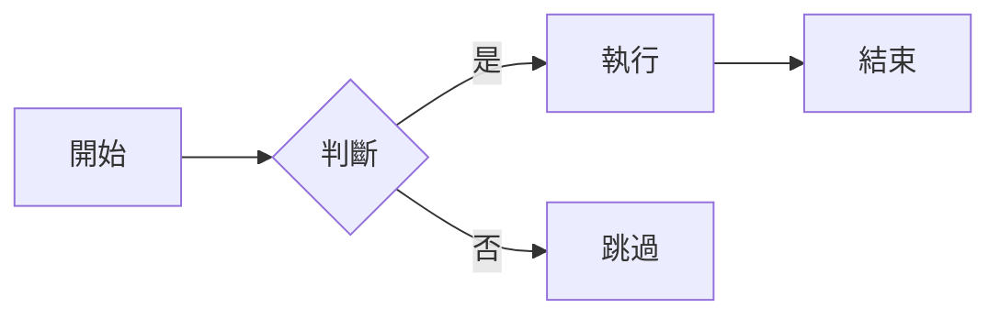
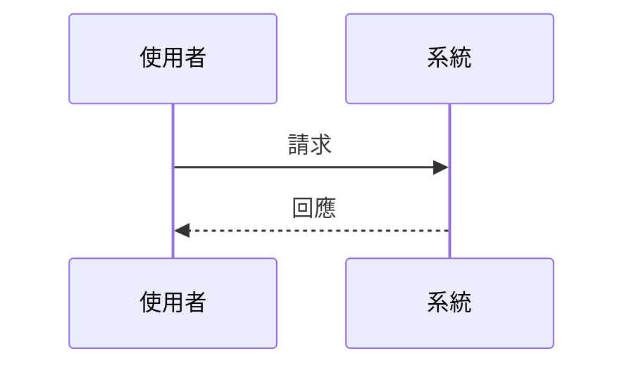
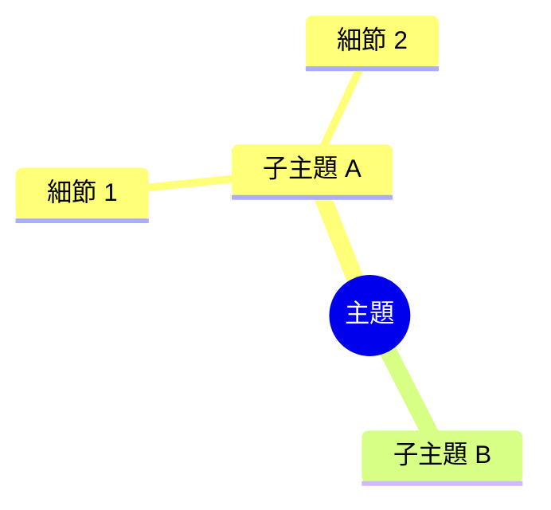
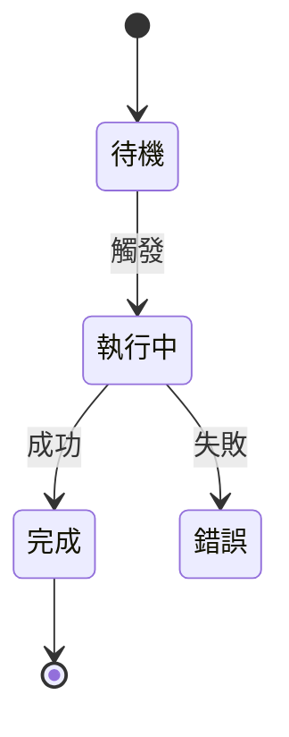
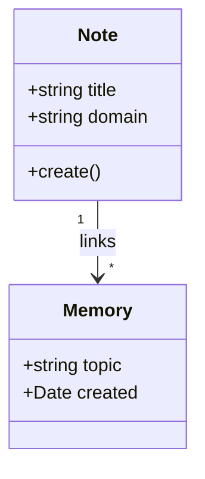

# Mermaid Patterns Formula

$$\text{MermaidType} = \text{TypeDetect}(\text{structure}) \to \text{Syntax}$$

## Flowchart

$$\text{使用時機}: \text{線性流程} + \text{決策分支} + \text{A} \to \text{B} \to \text{C 序列}$$

## Sequence Diagram

$$\text{使用時機}: \text{多主體（系統/人）之間的互動訊息}$$

## Mindmap

$$\text{使用時機}: \text{層次結構} + \text{\#\#/\#\#\# 嵌套} + \text{無橫向流程}$$

## State Diagram

$$\text{使用時機}: \text{明確狀態名稱} + \text{觸發條件} + \text{狀態機邏輯}$$

## Class Diagram

$$\text{使用時機}: \text{實體 + 屬性 + 關係}（\text{has-a, is-a, uses}）$$

